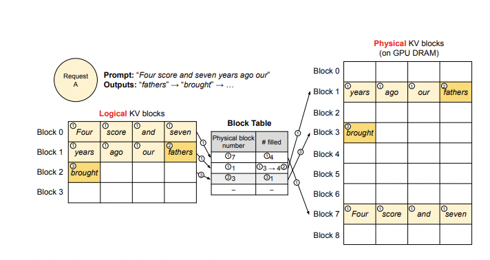

# FastChat与vLLM加速大模型推理
## FastChat
### FastChat介绍
一个用于训练、服务和评估基于大模型聊天机器人的开放平台。
核心功能包括：
1. 训练和评估大模型
2. 带有WebUI和与OpenAI兼容的RESTful API的多分布多模型服务系统
服务架构图：
用户的请求先经过Gradio Server，再经过Controller分发到对应的GPU Worker上进行处理。


 
### FastChat安装与使用
#### Install
```bash
pip3 install "fschat[model_worker,webui]"
```
#### 指令对话调用
```bash
python3 -m fastchat.serve.cli --model-path /root/autodl-tmp/Models/Qwen1.5-4B-Chat
```
#### 多GPU
```bash
python3 -m fastchat.serve.cli --model-path /root/autodl-tmp/Models/Qwen1.5-4B-Chat --num-gpus 2
```
#### Web UI访问
1. 创建Controller
```bash
python3 -m fastchat.serve.controller --host 0.0.0.0
```

2. 加载model_worker

- 2.1 普通加载
```bash
python3 -m fastchat.serve.model_worker --host 0.0.0.0 --model-path /root/autodl-tmp/Models/Qwen1.5-4B-Chat --trust-remote-code --dtype bfloat16
```
- 2.2 vLLM加载
```bash
python -m fastchat.serve.vllm_worker --host 0.0.0.0 --model-path /root/autodl-tmp/Models/Qwen1.5-4B-Chat --trust-remote-code --dtype bfloat16
```

3. 启动Gradio，实现demo展示
```bash
python -m fastchat.serve.gradio_web_server --host 0.0.0.0 --port 8000
```

以上就是Web UI访问的方式。
#### 启动Open AI的接口服务
```bash
python3 -m fastchat.serve.openai_api_server --host 0.0.0.0 --port 8000
```

本地访问api
```bash
curl http://localhost:8000/v1/chat/completions \
  -H "Content-Type: application/json" \
  -d '{
    "model": "Qwen1.5-4B-Chat",
    "messages": [{"role": "user", "content": "你会做计算题吗？99+123="}]
  }'
```

服务器映射到本地的接口为8001，因此接口稍微变化

output：
```json
"message":{"role":"assistant","content":"99 + 123 = 222"}
```
Clinet访问
```python
#!/usr/bin/env python
# -*- coding:utf-8 -*-
# @FileName  :client.py
# @Time      :2024/07/15 17:43:18
# @Author    :Lifeng
# @Description :
from openai import OpenAI
client = OpenAI(
    base_url="http://localhost:8000/v1",
    api_key="token-abc123",
)

completion = client.chat.completions.create(
    model="/root/autodl-tmp/Models/Qwen1.5-4B-Chat",
    messages=[
        {"role": "system", "content": "You are a helpful assistant."},
        {"role": "user", "content": "计算999+101=？"}
    ],
    max_tokens=1024,
    temperature=0.9,
    top_p=0.7,
)

print(completion.choices[0].message)
```

## vLLM
### vLLM介绍
vLLM是一个开源的大模型推理加速框架，通过PagedAttention高效地管理attention中缓存的张量，实现了比HuggingFace Transformers高14-24倍的吞吐量。

PagedAttention 是 vLLM 的核心技术，它解决了LLM服务中内存的瓶颈问题。传统的注意力算法在自回归解码过程中，需要将所有输入Token的注意力键和值张量存储在GPU内存中，以生成下一个Token。这些缓存的键和值张量通常被称为KV缓存。

● 主要特性   
- 通过PagedAttention对 KV Cache 的有效管理
- 传入请求的continus batching，而不是static batching
- 支持张量并行推理
- 支持流式输出
- 兼容 OpenAI 的接口服务
- 与 HuggingFace 模型无缝集成

VLLM支持绝大多数LLM模型的推理加速。它使用如下的方案大幅提升推理速度：

Continuous batching

- 在实际推理过程中，一个批次多个句子的输入的token长度可能相差很大，最后生成的模型输出token长度相差也很大。在python朴素推理中，最短的序列会等待最长序列生成完成后一并返回，这意味着本来可以处理更多token的GPU算力在对齐过程中产生了浪费。continous batching的方式就是在每个句子序列输出结束后马上填充下一个句子的token，做到高效利用算力。


PagedAttention
- 推理时的显存占用中，KVCache的碎片化和重复记录浪费了50%以上的显存。VLLM将现有输入token进行物理分块，使每块显存内部包含了固定长度的tokens。在进行Attention操作时，VLLM会从物理块中取出KVCache并计算。因此模型看到的逻辑块是连续的，但是物理块的地址可能并不连续。这和虚拟内存的思想非常相似。另外对于同一个句子生成多个回答的情况，VLLM会将不同的逻辑块映射为一个物理块，起到节省显存提高吞吐的作用。


 


需要注意-VLLM会默认将显卡的全部显存预先申请以提高缓存大小和推理速度，用户可以通过参数gpu_memory_utilization控制缓存大小。
### vLLM安装使用
```bash
pip install vllm
```
使用方法：
```python
import os
os.environ['VLLM_USE_MODELSCOPE'] = 'True'
from vllm import LLM, SamplingParams
prompts = [
    "Hello, my name is",
    "The president of the United States is",
    "The capital of France is",
    "The future of AI is",
]
sampling_params = SamplingParams(temperature=0.8, top_p=0.95)
llm = LLM(model="/root/autodl-tmp/Models/Qwen1.5-4B-Chat", trust_remote_code=True)
outputs = llm.generate(prompts, sampling_params)

#Print the outputs.
for output in outputs:
    prompt = output.prompt
    generated_text = output.outputs[0].text
    print(f"Prompt: {prompt!r}, Generated text: {generated_text!r}")
```

注意，截止到本文档编写完成，VLLM对Chat模型的推理支持（模板和结束符）存在问题，在实际进行部署时请考虑使用SWIFT或者FastChat。或者考虑加入对应模型的模版，如下方法：
```python
#!/usr/bin/env python
# -*- coding:utf-8 -*-
# @FileName  :vllm_qwen_infer.py
# @Time      :2024/07/15 17:18:05
# @Author    :Lifeng
# @Description :
from vllm import LLM
from vllm.sampling_params import SamplingParams


class QwenVllm(object):
    def __init__(self, gpu_num=2, max_tokens=512):
        self.gpu_num = gpu_num
        self.max_tokens = max_tokens
        self.model_path= "../../Models/Qwen1.5-4B-Chat/"
        # self.model_path= "/root/autodl-tmp/Models/codegeex4-all-9b"
        self.model, self.tokenizer = self.model_load_with_vllm()
 
 
    def model_load_with_vllm(self):
        """
        vllm 形式预加载 模型 
        """ 
        model = LLM(
            tokenizer=self.model_path,
            model=self.model_path,
            dtype="bfloat16",
            tokenizer_mode= 'slow',
            trust_remote_code=True,
            tensor_parallel_size=self.gpu_num,
            gpu_memory_utilization=0.8, # gpu 初始化显存占比，这里单卡48g显存
            max_seq_len_to_capture=8192,
            max_model_len = 8192
        )

        tokenizer = model.get_tokenizer()

        return model, tokenizer
 
 
    def qwen_chat_vllm(self, prompt):
        """ vllm batch推理注意 batch size 与 gpu 关系"""
 
        message= [
            {"role": "system", "content": "you are a great assistant."},
            {"role": "user", "content": prompt}
        ]
 
        text = self.tokenizer.apply_chat_template(
            message,
            tokenize=False,
            add_generation_prompt=True
        )
 
        # max_token to control the maximum output length
        sampling_params = SamplingParams(
            temperature=0.7,
            top_p=0.8,
            repetition_penalty=1.2,
            max_tokens=self.max_tokens)
 
        outputs = self.model.generate([text], sampling_params)
 
        response = []
        for output in outputs:
            # prompt = output.prompt
            generated_text = output.outputs[0].text
            response.append(generated_text)
 
        return response
 
if __name__ == '__main__':
    run = QwenVllm(gpu_num=1, max_tokens=1024) 
    # 大模型单轮对话生成
    prompt = """写一个快速排序代码"""
    response = run.qwen_chat_vllm(prompt=prompt)
    print(response)

openai接口
python -m vllm.entrypoints.openai.api_server \
--model Qwen/Qwen-7B \
--chat-template ./examples/template_chatml.jinja
在线服务调用
curl http://localhost:8000/v1/completions \
-H "Content-Type: application/json" \
-d '{
"model": "Qwen/Qwen-7B",
"prompt": "San Francisco is a",
"max_tokens": 7,
"temperature": 0
}'
客户端调用
from openai import OpenAI
client = OpenAI(
    base_url="http://localhost:8000/v1",
    api_key="token-abc123",
)

completion = client.chat.completions.create(
    model="Qwen/Qwen-7B",
    messages=[
        {"role": "system", "content": "我是一个名为 CodeGeeX 的AI编程助手，我由清华大学KEG实验室和智谱AI公司共同开发。我可以实现代码的生成与补全、自动添加注释、代码翻译以及智能问答等功能，能够帮助开发者显著提高编程效率。"},
        {"role": "user", "content": "计算999+101=？"}
    ],
    max_tokens=1024,
    temperature=0.9,
    top_p=0.7,
)

print(completion.choices[0].message)
```
## FastChat结合vLLM加速大模型推理
### 实现方法
#### 1. 创建Controller
```bash
python3 -m fastchat.serve.controller --host 0.0.0.0
```
#### 2. 加载model_worker
vLLM加载
```bash
python -m fastchat.serve.vllm_worker --host 0.0.0.0 --model-path /root/autodl-tmp/Models/Qwen1.5-4B-Chat --trust-remote-code --dtype bfloat16
```
#### 3. 启动Gradio，实现demo展示
```bash
python -m fastchat.serve.gradio_web_server --host 0.0.0.0 --port 8000
```
#### 4. 启动open AI的api服务
```bash
python3 -m fastchat.serve.openai_api_server --host 0.0.0.0 --port 8000
```
